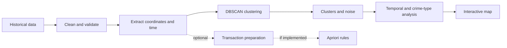

# 🔥 CrimeMapX

> **Discovering spatial and temporal patterns in historical crime data.**

CrimeMapX is a planned data mining and geographic visualization project for exploring reported historical crime records from the Mumbai/Indian region. It is designed to find dense geographic concentrations, study time-based patterns, and compare crime categories through an interactive map.

> **Important:** A cluster represents a concentration in historical or reported data. It does not necessarily represent actual underlying crime risk. CrimeMapX does not predict future crimes and must not be used to target individuals or communities.

## ✨ Project Snapshot

| Area | Planned approach |
| --- | --- |
| Hotspot discovery | DBSCAN density-based clustering |
| Spatial analysis | Latitude/longitude with an appropriate geographic distance metric |
| Pattern analysis | Hour, day, month, and crime category comparisons |
| Visualization | Interactive Mumbai map |
| Optional analysis | Apriori association rules |
| Current repository | Documentation and MIT license only |

## 🎯 Goals

- Discover dense concentrations in historical crime records.
- Identify isolated incidents and DBSCAN noise points.
- Compare crime patterns across time periods and categories.
- Examine the dominant crime types within discovered clusters.
- Present exploratory findings through an interactive geographic view.

## 🧭 How It Works



### DBSCAN

DBSCAN groups points by density. It is a strong fit for geographic exploration because it can:

- find clusters without a predefined number of groups;
- identify irregularly shaped dense regions; and
- label isolated incidents as noise or outliers.

| Parameter / concept | Meaning |
| --- | --- |
| `eps` | Neighborhood distance around a point. |
| `min_samples` | Minimum points needed for a dense neighborhood. |
| Core point | A point with enough neighbors within `eps`. |
| Border point | A point near a core point but not dense enough itself. |
| Noise point | A point not reachable from a cluster. |

Latitude and longitude are geographic coordinates, not ordinary Cartesian coordinates. A careful implementation should use an appropriate transformation or haversine distance, with `eps` interpreted in the matching units. Direct Euclidean distance on raw coordinates is only an approximation.

### Optional Apriori Analysis

Apriori is **not implemented in the current repository**. If added, it could find recurring combinations such as:

> **Evening + transportation-related location → Theft**

This would be an observed association in the dataset, not a causal explanation. Its key measures would be **support**, **confidence**, and **lift**.

## 🗂️ Dataset

No dataset is currently included. Complete these details when the data is added:

| Detail | Value |
| --- | --- |
| Source | `[DATASET SOURCE]` |
| Geographic scope | Mumbai/Indian region, subject to confirmation |
| Records | `[NUMBER OF RECORDS]` |
| Important columns | `[LIST ACTUAL COLUMNS]` |
| Dataset license | `[DATASET LICENSE]` |

Planned preprocessing includes data cleaning, missing-value handling, date/time extraction, location normalization, and latitude/longitude validation. No statistics, URLs, or column names are claimed until the dataset is available.

## 🧱 Planned Features

- **Data processing:** clean records, handle missing values, extract time features, and validate coordinates.
- **Hotspot detection:** run DBSCAN and separate clusters from noise.
- **Temporal analysis:** compare hour-wise, day-wise, and month-wise patterns when available.
- **Crime analysis:** inspect overall distributions and dominant categories by cluster.
- **Interactive mapping:** display incidents, clusters, concentrations, and outlier points.
- **Association mining:** add Apriori rules only if that component is implemented.

## 📁 Repository Structure

### Current structure

```text
CrimeMapX/
├── README.md
└── LICENSE
```

### Possible implementation structure

The structure below is a guide, not a list of files currently present:

```text
CrimeMapX/
├── data/
│   ├── raw/
│   └── processed/
├── notebooks/
├── src/
│   ├── preprocessing/
│   ├── clustering/
│   ├── association/
│   └── visualization/
├── outputs/
├── requirements.txt
├── README.md
└── LICENSE
```

## 🚀 Setup and Usage

The implementation and dependency files have not yet been added, so executable commands are not available. Once they exist, document the verified workflow here:

```bash
git clone [REPOSITORY_URL]
cd CrimeMapX

python -m venv venv
source venv/bin/activate          # Ubuntu/Linux
# venv\Scripts\activate           # Windows

pip install -r requirements.txt
```

Expected workflow:

1. Place the documented dataset in the project data directory.
2. Run preprocessing and feature engineering.
3. Apply DBSCAN to the geographic data.
4. Generate analysis outputs and the map.
5. Run Apriori only if implemented.

Replace `[REPOSITORY_URL]` and add actual commands when the project code is available.

## 📊 Illustrative Output

The following is fictional and does not describe an actual dataset finding:

```text
Cluster 0
- Incidents: [example]
- Dominant type: Theft
- Peak period: Evening
- Region: [example]
```

## ⚠️ Limitations

- Reported historical data can contain reporting and recording bias.
- Clusters do not necessarily indicate actual crime risk or crime rates.
- Missing or inaccurate coordinates can affect results.
- Geographic aggregation can change the apparent pattern.
- DBSCAN results depend strongly on `eps`, `min_samples`, and the distance metric.
- Association does not imply causation.
- Historical patterns are not guaranteed future behavior.
- Findings should not be used to target people or communities or make unsupported public-safety claims.

## 🔭 Future Scope

- Real-time data integration with appropriate safeguards.
- Better geospatial distance calculations and parameter selection.
- Filters for crime type, time, and cluster.
- Comparison with other clustering and spatial-statistics methods.
- Dashboard deployment and additional Indian city datasets.

## 🎓 Academic Relevance

CrimeMapX brings together:

`Data Mining` · `Unsupervised Learning` · `Clustering` · `Association Rule Mining` · `Spatial Data Analysis` · `Geographic Visualization` · `Exploratory Data Analysis`

## 👥 Team

- Sampada-26
- Kranus57
- vidishamankar

## 📄 License

Released under the [MIT License](LICENSE).
